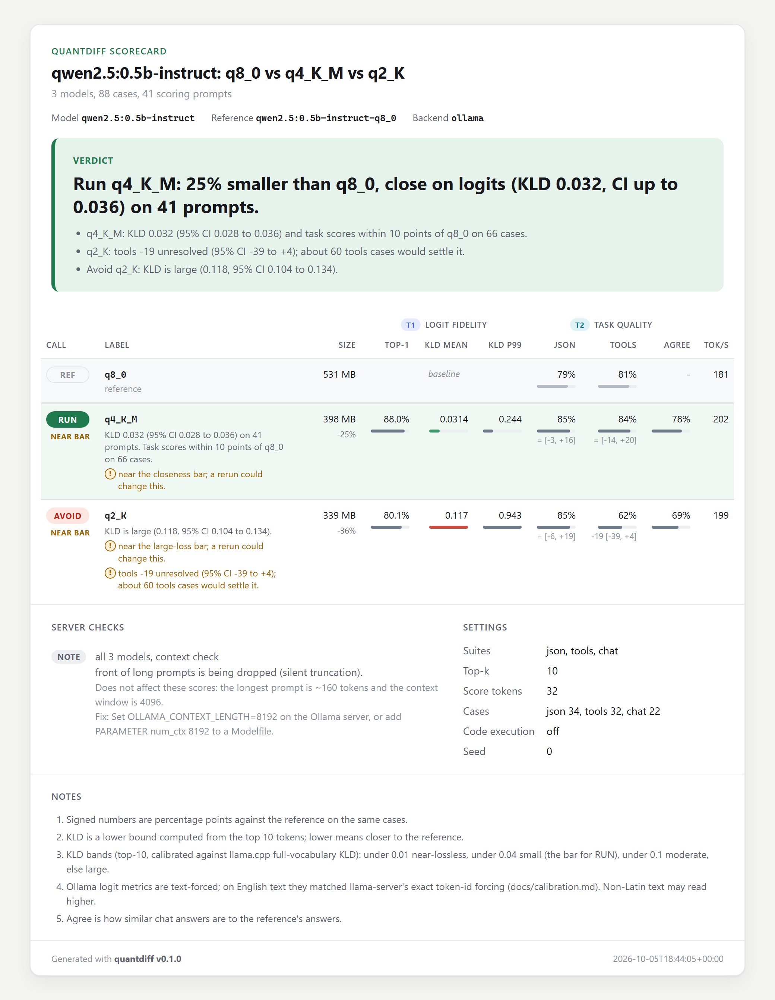

# quantdiff

**Find out which download of a local model to actually run, judged on your own prompts.**

quantdiff compares quantized variants of the same model (an Ollama tag, an Unsloth GGUF, a
bartowski GGUF in llama-server, the same model in LM Studio or vLLM) against a higher precision
reference and prints a scorecard you can paste into a terminal, a Reddit post, or a browser.

llmfit tells you what fits. quantdiff tells you which version is best and whether it is being
served correctly.

- Zero runtime dependencies. Standard library only.
- Works with Ollama, llama-server (llama.cpp), and any OpenAI-compatible server (LM Studio, vLLM,
  mlx_lm.server, and others).
- Outputs a shareable `card.png`, a Reddit-ready `card.md`, a self-contained `card.html`, and
  the raw `report.json`.

## Why

Every time a model ships, several uploaders race to publish quants within hours. Chat templates
get patched after release. Some uploads use an imatrix, some do not, some get re-uploaded twice in
the first week. Most people pick a quant by habit, by file size, or by someone else's wikitext
perplexity numbers measured on a different build.

None of that tells you how a given download behaves on the prompts you care about, or whether the
server you run it in is applying the right template and the full context window. quantdiff
measures that directly: same prompts, same greedy decoding, every variant checked against one
reference, with the setup problems caught before scoring starts.

## Install

```
pip install quantdiff
```

or run it without installing:

```
uvx quantdiff --version
```

Python 3.10 or newer. Nothing else is pulled in.

## Quickstart: Ollama (60 seconds)

Pull two quantizations of a small model, then let quantdiff find them:

```
ollama pull qwen2.5:0.5b-instruct-q8_0
ollama pull qwen2.5:0.5b-instruct-q4_K_M
quantdiff discover
```

`discover` groups the downloads of each model, picks the most precise one as the reference, and
prints the command to run:

```
qwen2.5:0.5b-instruct
  Q8_0     531 MB  qwen2.5:0.5b-instruct-q8_0  (reference)
  Q4_K_M   398 MB  qwen2.5:0.5b-instruct-q4_K_M
  Compare them:
    quantdiff run --ref ollama:qwen2.5:0.5b-instruct-q8_0 --cand ollama:qwen2.5:0.5b-instruct-q4_K_M
```

Paste it. quantdiff checks that every server and model is reachable before doing any work, shows
a progress bar with an ETA, prints the scorecard, and writes `runs/<UTC timestamp>/` with
`card.png`, `card.md`, `card.html` and `report.json`. Add `--open` to open the card when it is
done.

quantdiff uses `OLLAMA_HOST` if set, otherwise `http://127.0.0.1:11434`.

## Quickstart: llama-server

Start one llama-server per variant on different ports. quantdiff does not launch servers for you.

```
llama-server -hf bartowski/Qwen2.5-1.5B-Instruct-GGUF:Q8_0   --port 8080
llama-server -hf bartowski/Qwen2.5-1.5B-Instruct-GGUF:Q4_K_M --port 8081
llama-server -hf unsloth/Qwen2.5-1.5B-Instruct-GGUF:Q4_K_M   --port 8082

quantdiff run \
  --ref  q8=llamacpp:http://127.0.0.1:8080 \
  --cand bartowski-q4km=llamacpp:http://127.0.0.1:8081 \
  --cand unsloth-q4km=llamacpp:http://127.0.0.1:8082 \
  --hf-repo Qwen/Qwen2.5-1.5B-Instruct
```

llama-server is the most precise backend: when the reference is also llama-server, quantdiff
feeds exact token ids for the logit metrics, and `--hf-repo` lets it compare each server's embedded
chat template with the upstream `tokenizer_config.json` on Hugging Face.

You can mix backends. A common question is "is the Ollama tag as good as the GGUF I would run in
llama-server?" With a text-only reference such as Ollama, every candidate is teacher-forced by
text, and the card footnotes that:

```
quantdiff run --ref ollama:qwen2.5:1.5b-instruct-q8_0 \
  --cand ollama=ollama:qwen2.5:1.5b-instruct-q4_K_M \
  --cand gguf=llamacpp:http://127.0.0.1:8081
```

## LM Studio, vLLM, MLX, and other OpenAI-compatible servers

Use `openai:<base_url>#<model>`, where `base_url` is the same URL you would give an OpenAI client.

```
# LM Studio (Developer tab, start server)
quantdiff run --ref ollama:qwen2.5:1.5b-instruct-q8_0 \
  --cand lmstudio=openai:http://127.0.0.1:1234/v1#qwen2.5-1.5b-instruct

# vLLM
vllm serve Qwen/Qwen2.5-1.5B-Instruct-AWQ --port 8000
quantdiff run --ref ollama:qwen2.5:1.5b-instruct-q8_0 \
  --cand awq=openai:http://127.0.0.1:8000/v1#Qwen/Qwen2.5-1.5B-Instruct-AWQ
```

If the server needs an API key, put it in an environment variable and name the variable in the
spec. The key itself never appears on the command line or in the report.

```
export MY_SERVER_KEY=...
quantdiff run ... --cand remote=openai:https://gpu-box.lan/v1#my-model@env:MY_SERVER_KEY
```

## Spec grammar

```
[label=]ollama:<tag>                         e.g. ollama:qwen2.5:7b-instruct-q4_K_M
[label=]llamacpp:<base_url>                  e.g. llamacpp:http://127.0.0.1:8080
[label=]openai:<base_url>#<model>[@env:VAR]  e.g. openai:http://127.0.0.1:1234/v1#qwen2.5-7b-instruct
```

The optional `label=` prefix sets the name shown on the scorecard. Without it quantdiff derives
one from the spec.

## CLI reference

```
quantdiff discover [--host URL]                            # list local Ollama models
quantdiff run --ref SPEC --cand SPEC [--cand SPEC ...] [options]
quantdiff card PATH [--format txt|md|html|png] [-o FILE]   # PATH = run dir or report.json
quantdiff suites                                           # list built-in suites
quantdiff --version
```

`-v` / `--verbose` (before or after the command) prints debug logs to stderr.

| `run` option | Meaning |
| --- | --- |
| `--ref` | The reference model. Use the highest precision you can serve. |
| `--cand` | A candidate. Repeat for each variant. |
| `--suite` | Comma separated task suites. Default `json,tools,chat`, plus `code` with `--allow-code-exec`. |
| `--prompts` | Your own chat prompts as JSONL (see below). Without `--suite`, only these run. |
| `--scoring-prompts` | Your own raw text prompts for the logit metrics, as JSONL. |
| `--max-cases N` | Cap each suite, your prompts file and the scoring prompts at N. For quick runs. |
| `--allow-code-exec` | Run the `code` suite's hidden tests against model output. Off by default. |
| `--top-k` | Top tokens requested per position for the logit metrics (1 to 20, default 10). |
| `--score-tokens` | Reference tokens scored per scoring prompt (default 32; 0 disables Tier 1). |
| `--seed` | Seed sent to every server (default 0). |
| `--hf-repo` | Upstream Hugging Face repo used for the chat template check. |
| `--offline` | Never contact huggingface.co. |
| `--no-preflight` | Skip the pre-flight checks. Not recommended. |
| `--context-probe-tokens` | Length of the truncation probe (default 6000, minimum 1000, 0 disables). |
| `--title` | Title printed on the scorecard. |
| `--out` | Parent directory for runs. Default `runs`. |
| `--no-png` | Skip `card.png`. |
| `--open` | Open the HTML card in your browser when the run finishes. |
| `--no-cache` | Rerun the reference even if its outputs are cached. |
| `-q`, `--quiet` | No progress output. |
| `--max-size SIZE` | Largest download you can run, such as `6GB`, `6.5G` or `800MB` (decimal units). The pick is the smallest close download that fits; with none, the best USABLE one that fits. |
| `--fail-on LEVEL` | `avoid`: exit 3 on any AVOID or FAILED candidate, or when nothing is RUN and nothing USABLE fits. `inconclusive`: also on any UNSURE or USABLE candidate, or when nothing is RUN. Default `never`. |

`quantdiff card` re-renders a scorecard from a finished run without touching any server.
`--format png` writes a 2x image for Reddit or X.

## What the scorecard shows

The card answers the question first: one headline sentence ("Run q4_K_M ..."), then a row per
model with a status chip (REF, RUN, OK, AVOID, UNSURE, FAILED) and a short reason. The metrics
behind it:

| Tier | Metric | What it measures | Backends |
| --- | --- | --- | --- |
| 1 (logit) | top-1 agreement | Fraction of positions where the candidate's most likely next token equals the reference's greedy token, with the reference's text fed in. Higher is better. | Any backend that returns logprobs |
| 1 (logit) | KLD mean / p99 | KL divergence from the reference's next-token distribution. Lower is better. A lower bound on full-vocabulary KL. p99 is shown only with 1000+ positions. | Same |
| 2 (task) | json | Output parses and validates against the case's JSON schema. | All |
| 2 (task) | tools | Calls the expected tool, with valid arguments, matching the expected values. | All |
| 2 (task) | code | Generated function passes hidden asserts. Only with `--allow-code-exec`. | All |
| 2 (task) | agree | Text similarity of chat answers to the reference model's answers. | All |
| size | Size | Size of the download on disk, and the change against the reference. | Ollama, llama-server |
| perf | tok/s | Decode speed as measured by the server (labelled "wall" when only wall-clock time is available). | All |

KLD is put in plain bands: near-lossless (under 0.01), small (under 0.04), moderate (under 0.10)
and large, at the default `--top-k 10`. The bars are calibrated against llama.cpp's
full-vocabulary `llama-perplexity --kl-divergence` on the same weights (quantdiff's top-10 bound
reads about two thirds of it), so 0.04 here is about 0.06 there, a typical Q4_K_M of a 7 to 8B
model. See [docs/calibration.md](docs/calibration.md).

The reference appears as its own REF row with its task pass rates. Candidate pass rates carry a
paired delta against it, for example `-30*`; a `*` marks a significant difference, and the HTML
card adds the 95% interval. A gain that is within noise shows as `=`, never as a win. Suites
where the reference itself passes under half the cases are greyed out and not used to judge.
Columns for suites that did not run are hidden. When every model shares a name prefix, the card
states it once and labels rows by their quant (`q4_K_M`, `q2_K`).

Logit metrics are exact when the reference and candidate are both llama-server. Everywhere else
teacher forcing goes through text, and the card notes it (see FAQ).

Pre-flight checks run on every server before it is scored. They are listed once under
**Server checks**, each with a sentence on whether it could have changed these scores:

- **Context truncation.** A needle placed at the start of a long prompt (default 6000 tokens),
  plus a short control prompt. If the model finds the needle in the control but not in the long
  prompt, the server is silently truncating, which is common with Ollama's default `num_ctx`.
- **Chat template.** llama-server only: the template embedded in the GGUF versus the upstream
  `tokenizer_config.json` from `--hf-repo`. Catches quants uploaded before a template fix.
- **Tokenizer match.** Candidate and reference must tokenize the same text identically, otherwise
  logit metrics are not comparable and are withheld.
- **Logprob availability.** If a server does not return logprobs, Tier 1 is skipped for it and
  the card says so.

## Example scorecard

A real run with default settings, exactly the command `quantdiff discover` printed (Qwen2.5 0.5B
Instruct from Ollama on a GTX 1650, 2 minutes 49 seconds):

```
quantdiff run --ref ollama:qwen2.5:0.5b-instruct-q8_0 --cand ollama:qwen2.5:0.5b-instruct-q4_K_M --cand ollama:qwen2.5:0.5b-instruct-q2_K
```

This is `card.png` exactly as quantdiff wrote it:



Q4_K_M is the pick: its KLD interval (0.028 to 0.036) lies entirely under the 0.04 closeness bar,
and its task scores are within 10 points of Q8_0 on 66 paired cases. The card flags it as near
the bar, because the interval's upper end is within 10% of it. Q2_K is marked AVOID because its
whole KLD interval (0.104 to 0.134) is in the large band, about Q2_K territory on llama.cpp's
full-vocabulary scale; its 19-point drop on tool calls is shown as an unresolved caveat, since 32
cases cannot settle it. The context-length note is muted because it cannot have affected these
short prompts.

Running only `--ref ...q8_0 --cand ...q4_K_M` answers the most common question, "can I drop from
Q8 to Q4?", with the same headline in about a minute and a half, since the reference's outputs
come from the cache.

## Reading the verdict

The card opens with one sentence that answers the question you ran it for, such as:

```
Run q4_K_M: 25% smaller than q8_0, close on logits (KLD 0.03, CI up to 0.036) on 41 prompts.
Best that fits 6 GB: q4_K_M, moderate loss (KLD 0.044).
No download is close to q8_0; q4_K_M has the smallest loss among the smaller downloads (moderate, KLD 0.044).
Keep q8_0 for now: no candidate is shown to be close on 12 prompts and 24 cases.
Keep q8_0: q2_K shows a measured loss.
```

The sentences under it give the numbers, for example "q4_K_M: KLD 0.029 (95% CI 0.024 to
0.035) and no significant task loss vs q8_0 on 24 cases (95% CI -21 to +12)." When nothing is
recommended, a separate next step says what to do, such as "Rerun with --max-cases 40 to
decide." or "Pass --max-size with the memory you can spare".

Every candidate gets a status: **RUN** (the one to use), **OK** (also close to the reference,
but larger than the pick or over your `--max-size`), **USABLE** (a measured, moderate loss; a
sound choice when nothing closer fits), **AVOID** (a large loss or measured task breakage),
**UNSURE** (not enough evidence either way) or **FAILED**.

Each candidate is judged against the reference on its own, so adding or removing a candidate
never changes another one's status. A candidate earns RUN or OK only with positive evidence
that it is close:

- **With logit metrics** (any server that returns logprobs), closeness rests on KLD: at least 8
  scoring prompts, and the 95% interval of the mean KLD ends below 0.04 (at the default
  `--top-k 10`; the bar scales with top-k). A KLD shown that small also bounds how far the two
  models' outputs can differ. Task suites of a few dozen cases cannot bound small differences,
  so here they work as a breakage detector: any significant loss is AVOID, and a wide interval
  is shown honestly ("no significant task loss vs q8_0 on 24 cases"), never claimed as proof.
- **Without logit metrics**, tasks must prove closeness on their own: the suites the reference
  passes at least half of are pooled, and with at least 20 paired cases the 95% interval of the
  pass-rate difference must not reach more than 10 points below zero. That usually takes more
  cases than the built-in suites hold, so expect UNSURE and add your own prompts.

The closeness bar sits about where a Q4_K_M of a 7 to 8B model lands, so a popular quant can
fall just above it. With at least 8 prompts, a KLD interval that starts above 0.04 with a mean
under 0.10 is USABLE, not AVOID. A candidate is AVOID when a task suite, or the suites pooled
together, drop significantly against the reference (paired McNemar test), or when at least 8
prompts put both its mean KLD and the low end of its interval at 0.10 or more. A large-looking
KLD on fewer prompts is UNSURE ("looks large on 3 prompts"). A candidate never "beats" the
reference: a higher score that is within noise is shown as equal, and a significantly higher
one is flagged as a sign the suite is too small or the reference is itself quantized.

**Pick by size.** Pass `--max-size` with the largest download you can run (decimal units:
`6GB`, `6.5G`, `800MB`). The pick is then the smallest close candidate that fits. When no close
candidate fits, the headline names the USABLE candidate with the lowest KLD that fits ("Best
that fits 6 GB: ...") and the details name the close download that does not ("q5_K_M is close
but needs 7.1 GB."). A candidate whose size the server does not report is never assumed to fit.

**UNSURE does not mean safe.** It means this run could not decide. The card names the candidate
that looks closest, says what is missing, and estimates how much more would decide, for example
"Rerun with --max-cases 40 to decide.", or how many of your own prompts to add when the
built-in suites are too small.

Some calls come with a caveat that does not change the status but is worth reading:

- "near the closeness bar; a rerun could change this": the KLD interval straddles a bar or ends
  within 10% of it.
- "tools -17 unresolved (95% CI -42 to +6); rerun with --max-cases 60": a suite scored more than
  10 points lower without the drop being significant. The first one is shown right under the
  headline.
- On Ollama and other text-forced servers, when most scoring prompts are not Latin script, the
  KLD may read high; the card says to confirm with llama-server (exact token ids) before ruling
  out a download.

The full rules are in [docs/methodology.md](docs/methodology.md#how-the-verdict-is-decided).

Things to check before trusting a verdict:

- **Server checks** marked as affecting the scores. A truncated context or a stale template
  usually explains a bad score better than the quantization does. Checks that cannot have changed
  these numbers (for example a 4096-token context when every prompt is shorter) are shown muted.
- How many cases ran. `--max-cases 5` is for smoke tests, not conclusions.
- Whether the reference is BF16/F16 or a Q8_0 proxy. A Q8_0 reference makes every candidate look
  slightly closer than it is.

To use quantdiff in CI, pass `--fail-on avoid`: the run exits with code 3 when any candidate is
AVOID or FAILED, or when no candidate is RUN and no USABLE candidate fits your `--max-size`
(any USABLE one counts when there is no budget), so a run with too little evidence never
passes. `--fail-on inconclusive` also fails on any UNSURE or USABLE candidate, and whenever no
candidate is RUN.

## Your own prompts

The built-in suites are a starting point. The prompts that matter are yours.

`--prompts` takes JSONL. The shorthand form is one prompt per line:

```
{"prompt": "Summarize this incident report in three bullet points: ..."}
{"prompt": "Write a SQL query that returns the top 5 customers by revenue in 2025."}
```

Shorthand prompts are scored as `chat` cases: by agreement with the reference model's answer.

For pass/fail checks, write full task cases. Field names match `quantdiff.types.TaskCase`:

```
{"id": "invoice-1", "kind": "json", "messages": [{"role": "user", "content": "Extract vendor and total from: ..."}], "json_schema": {"type": "object", "required": ["vendor", "total"], "properties": {"vendor": {"type": "string"}, "total": {"type": "number"}}}}
{"id": "weather-1", "kind": "tools", "messages": [{"role": "user", "content": "What is the weather in Oslo?"}], "tools": [{"name": "get_weather", "description": "Current weather for a city", "parameters": {"type": "object", "properties": {"city": {"type": "string"}}, "required": ["city"]}}], "expected_tool": "get_weather", "expected_arguments": {"city": "Oslo"}}
```

`expected_arguments` is a subset match: every key listed must be present with an equal value.

`--scoring-prompts` takes raw text prompts (no chat template) for the Tier 1 metrics, one
`{"id": "...", "text": "..."}` object per line. Use text that looks like your workload: code,
legal prose, a language other than English.

## Python API

```python
import quantdiff

report = quantdiff.compare(
    ref="ollama:qwen2.5:7b-instruct-q8_0",
    candidates=["ollama:qwen2.5:7b-instruct-q4_K_M", "llamacpp:http://127.0.0.1:8080"],
    suites=("json", "tools"),
    prompts=None,
)
print(quantdiff.verdict(report))
with open("card.html", "w", encoding="utf-8") as f:
    f.write(quantdiff.render_html(report))
```

## How it works

1. Pre-flight checks on every server (context, template, tokenizer, logprobs).
2. Tier 1: the reference greedily continues each raw scoring prompt and records its top-k
   distribution at each step. Each candidate is then teacher-forced on the same text and its top-k
   distributions are compared position by position.
3. Tier 2: each task case is sent through each server's own chat template with greedy decoding,
   and the answer is checked (schema, tool call, hidden tests, or agreement with the reference).
4. Results are aggregated, tested against noise, and rendered.

The reference model's outputs are cached, so the second run against the same reference only runs
the candidates. The cache key covers the server URL, the weights fingerprint (the Ollama digest or
the GGUF size), the chat template, the suites and the settings, so re-pulling a fixed upload
invalidates it. The cache lives in `%LOCALAPPDATA%\quantdiff\cache` on Windows and in
`$XDG_CACHE_HOME/quantdiff` (or `~/.cache/quantdiff`) elsewhere. Set `QUANTDIFF_CACHE_DIR` to move
it, or pass `--no-cache` to skip it.

The details, including the KL lower bound derivation and the limitations, are in
[docs/methodology.md](docs/methodology.md).

## Security model

quantdiff talks to model servers and executes nothing from them by default. In short:

- **Zero runtime dependencies.** After the March 2026 LiteLLM PyPI compromise, we decided the
  smallest useful supply chain is none. Everything is standard library.
- **No code execution** unless you pass `--allow-code-exec`. With it, generated code for the
  `code` suite runs in a separate subprocess with a scrubbed environment, a timeout, and POSIX
  resource limits. That is isolation, not a security sandbox: only enable it for models you would
  run code from anyway.
- **Network.** quantdiff connects only to the servers you name, plus `huggingface.co` for the chat
  template check. `--offline` disables the Hugging Face request. The HTTP client ignores
  `HTTP(S)_PROXY`, refuses redirects, non-http(s) schemes, and credentials embedded in URLs, and
  caps response size. Server text is sanitized before it reaches your terminal.
- **PNG cards** are rendered by a Chromium-based browser already on your machine (Chrome, Edge,
  Brave, or Chromium; set `QUANTDIFF_BROWSER` to pick one), headless, with a throwaway profile.
  The card has no scripts or external resources, so the browser makes no network requests.
- **Secrets.** API keys are read from environment variables named in the spec, never passed as
  arguments and never written to reports.
- **Output.** The HTML card escapes all model text and contains no JavaScript. The reference cache
  is plain JSON, never pickle.

See [SECURITY.md](SECURITY.md) for the threat model and how to report a vulnerability.

## FAQ

**Why not just run perplexity on wikitext?**
Perplexity on wikitext measures how well a model predicts Wikipedia, averaged over every token. It
is a fine sanity check, but it does not tell you whether tool calls still parse, whether JSON still
validates, or whether the model you are serving has the right template. Two quants can have nearly
identical perplexity and behave differently on structured output. quantdiff measures distance from
the reference on your text and pass rates on tasks that break first.

**Why is KLD a lower bound?**
Servers return at most 20 logprobs per position, so the full distributions are not available.
quantdiff computes KL on a coarser partition: the tokens present in both top-k lists, the
reference's tokens missing from the candidate's list, and everything else. Merging outcomes can
only reduce KL divergence (the data processing inequality). The one mass the server does not
report is bounded by the candidate's smallest listed probability and set to the value that
minimizes the result. So the reported number is never larger than the true full-vocabulary KL,
yet a candidate that drops the reference's likely tokens from its top-k is still penalized. For
full-vocabulary KLD on llama.cpp, use `llama-perplexity --kl-divergence`. The methodology doc
shows how to cross-check.

**Why are Ollama numbers footnoted?**
Teacher forcing needs the candidate to see exactly the reference's tokens. llama-server accepts
token ids, so quantdiff feeds them directly. Ollama and OpenAI-compatible servers only accept text,
so quantdiff concatenates the reference's tokens as text and the server re-tokenizes it. Usually
that produces the same tokens; sometimes it merges or splits differently, which shifts positions.
The card footnotes every candidate scored this way. Compare those numbers with each other, not
with exact ones.

**Does it work with MLX?**
Yes, through an OpenAI-compatible server such as `mlx_lm.server`. Use
`openai:http://127.0.0.1:8080/v1#<model>`. Tier 1 needs the server to return logprobs.

**Can I compare different models, not quants of one model?**
Tier 2 will run, but quantdiff is built for variants of one model against its own reference. The
tokenizer check will withhold logit metrics when tokenizers differ.

**What should the reference be?**
BF16 or F16 if you can serve it. If memory is tight, Q8_0 is a close proxy. Note that this makes
every candidate look slightly better than it would against BF16; the methodology doc explains.

**Does quantdiff download models or start servers?**
Not in v0.1. You start Ollama, llama-server, LM Studio, or vLLM yourself. `quantdiff discover`
finds what Ollama already has.

**My PNG is missing.**
`card.png` needs a Chromium-based browser. Without one the run still writes `card.md` and
`card.html` and says why the PNG was skipped. Install Chrome, Edge, Brave or Chromium, or point
`QUANTDIFF_BROWSER` at one.

## Roadmap

Not in v0.1, planned later:

- Download and launch servers for you.
- AWQ and GPTQ specific handling.
- KV cache quantization comparisons.
- Vision models.
- A hosted leaderboard of submitted scorecards.

## Contributing

See [CONTRIBUTING.md](CONTRIBUTING.md). Bug reports with a `report.json` attached are the most
useful kind.

## License

Apache License 2.0. See [LICENSE](LICENSE).
